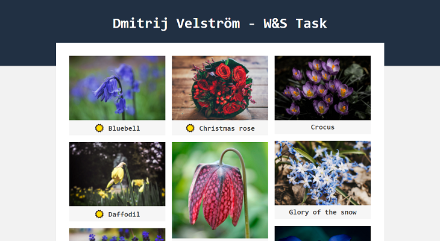

# Will & Skill Interview Task

In this task I developed a [NextJS](https://nextjs.org/) app for people with a botanical interest using a Flower API provided by Will&Skill. The app consist of three pages: a landing page with a flower gallery, a flower details page and a seasons page. Flower gallery uses [Masonry](https://www.npmjs.com/package/react-masonry-css) library for React. Seasons page provides an overview of which flowers bloom during which seasons.

It's possible to leave comments on individual flowers. Functions for interaction with the comment API are collected in JSX Kit called [CommentKit](pages/data/CommentKit.js).

